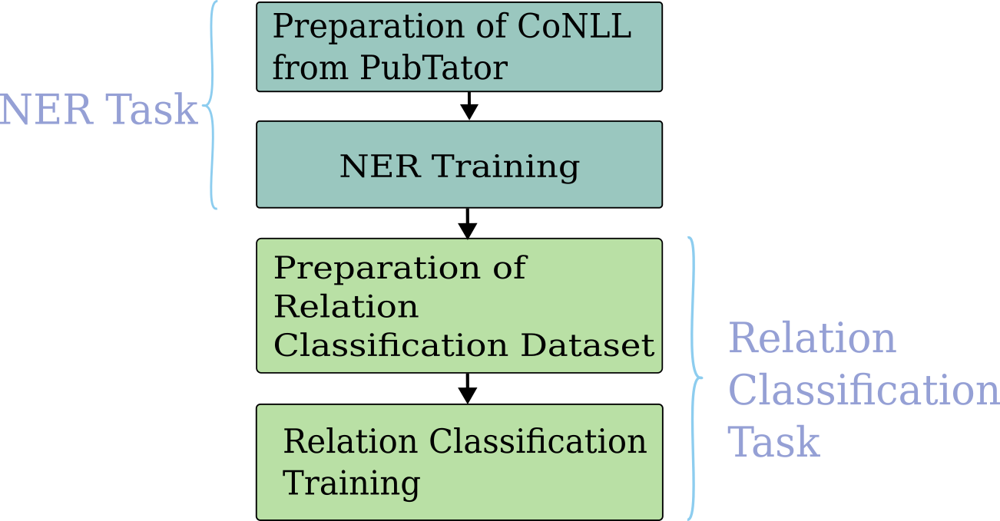

# Automatic Clinical Relation Extraction

Task - Identifying test results and measurements within clinical documents in Italian, Spanish and Basque.

Dataset for Italian - https://e3c.fbk.eu/clinkart
Dataset for Spanish and Basque - https://e3c.fbk.eu/testlinkiberlef

### Preliminary Instructions
- Download the zip file of the datasets and keep them in the repo main folder.

## Fine-tuning Transformer models
Done in 2 stages
<figure>

<figcaption>Flowchart of the Relation Extraction training process</figcaption>
</figure>

3 models used for both stages - mBERT, XLM-Roberta and BERT; fine-tuned with monolingual and multilingual data.

In Fine-Tuning-Transformers/
- `sh prepare_script.sh` - to prepare required data
- `create_multilingual_data.py` - to create multilingual data from each language dataset.
- `train_ner*.py` - to train on the NER task.
- `infer_ner*.py` - to infer on the NER task.
- `rc_dataset*.py` - to create the Relation Classification dataset.
- `train_rc*.py` - to train on the RC task.
- `infer_rc*.py` - to infer on the RC task.
- sweep scripts are for hyperparameter tuning using wandb sweeps.

## LLM Few shot learning

Few shot learning with gpt-4-turbo, gpt-4 and gpt-3.5-turbo

Files inside `LLMs\`

## Error Analysis

In Error_Analysis/

Quantitative and Qualiatative Analysis of NER and Relation Extraction output.